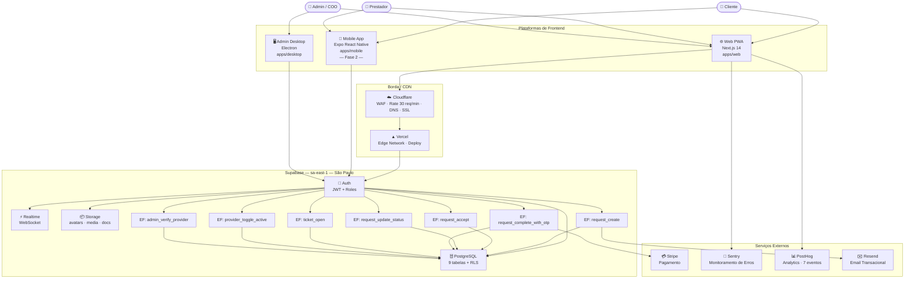
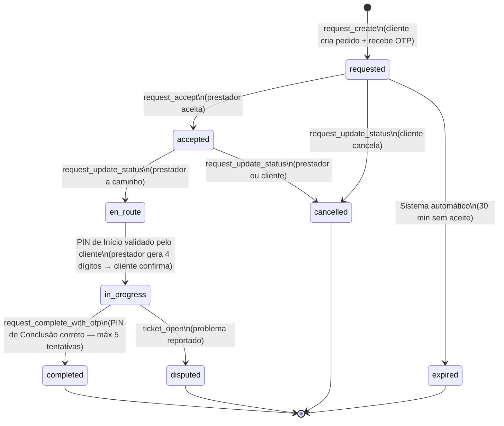
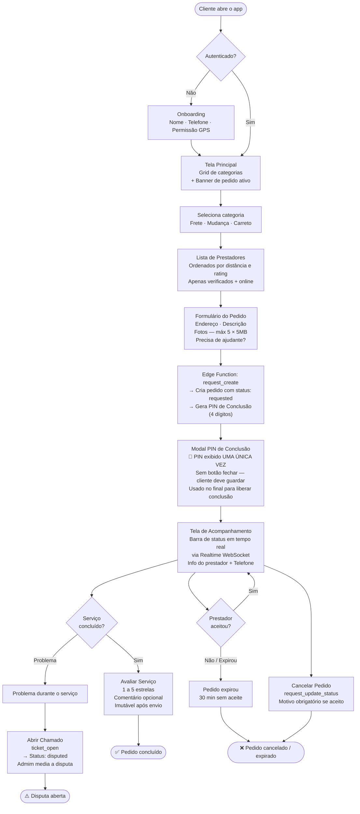
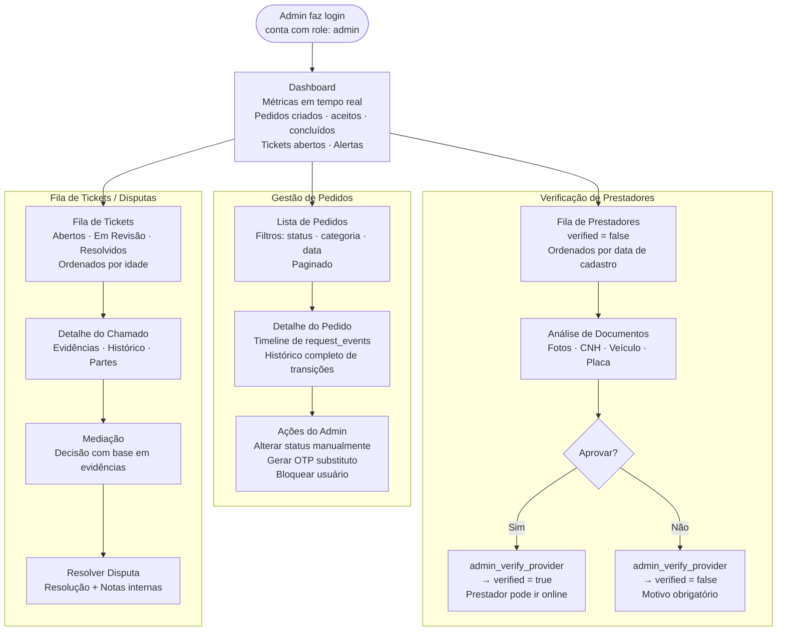
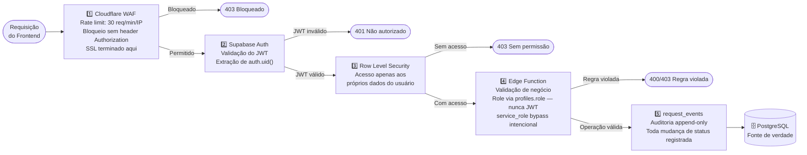

# Fluxograma — Ajudaê

> **Gerado em:** 2026-03-18
> Mapeia a arquitetura completa de plataformas e todos os fluxos de usuário do sistema.

---

## 1. Arquitetura Geral do Sistema

Visão macro das três plataformas de frontend e sua relação com o backend, CDN e serviços externos.

---

## 2. Máquina de Estados do Pedido

Todas as transições possíveis do campo `requests.status`. Toda mudança registra um evento em `request_events` (auditoria obrigatória).

> **Sistema Dual-PIN — atualizado 2026-04-26 (aprovado CPO):**
> O fluxo anterior usava um único OTP de 6 dígitos gerado na criação do pedido e digitado pelo prestador na conclusão.
> O novo sistema usa **dois PINs independentes de 4 dígitos**, garantindo proteção simétrica:
>
> | PIN | Gerado por | Digitado por | Momento | Bloqueia |
> |---|---|---|---|---|
> | **PIN de Início** | Prestador (ao chegar) | Cliente | `en_route → in_progress` | Prestador não inicia sem presença do cliente |
> | **PIN de Conclusão** | Sistema (na criação do pedido) | Prestador | `in_progress → completed` | Prestador não conclui sem autorização do cliente |
>
> - PIN de Início: válido por 10 minutos, máximo 3 gerações/hora por prestador
> - PIN de Conclusão: exibido UMA única vez ao cliente no Modal OTP (Tela 4B), não recuperável
> - Após 5 tentativas erradas em qualquer PIN: status → `disputed` automaticamente
> - Todos os erros registrados em `request_events` para auditoria

---

## 3. Fluxo do Cliente — Web PWA e Mobile App

---

## 4. Fluxo do Prestador — Web PWA e Mobile App

```mermaid
flowchart TD
    START(["Prestador abre o app"])

    AUTH_CHECK{"Autenticado\ne verificado?"}
    ONBOARD["Onboarding\nFoto · Bio · Categorias\nVeículo · Placa · Raio 1–20km"]
    AWAIT_VERIFY["Aguardando aprovação\ndo Admin / COO"]

    HOME["Tela Principal\nToggle Online / Offline"]

    VERIFIED{"Verificado\npelo Admin?"}
    TOGGLE_ON["provider_toggle_active\nStatus: online"]
    WAIT["Aguardando pedidos\nFila ao vivo via Realtime"]

    REQ_CARD["Card do Pedido recebido\nCategoria · Endereço · Distância\nFotos · Descrição\n⏱️ Timer: 30 segundos"]

    ACCEPT_DEC{"Aceitar\npedido?"}
    REJECT["Recusar\nPedido retorna à fila"]
    ACCEPT["request_accept\n→ Status: accepted"]

    EN_ROUTE["A Caminho\nrequest_update_status\n→ Status: en_route"]
    GEN_PIN["Gerar PIN de Início\n4 dígitos — mostrar ao cliente\nVálido por 10 min"]
    CLIENT_PIN["Cliente digita\nPIN de Início no app"]
    IN_PROG["PIN validado\nrequest_update_status\n→ Status: in_progress"]

    OTP_INPUT["Digitar PIN de Conclusão\n4 dígitos fornecidos pelo cliente\n(gerado na criação do pedido)"]
    OTP_VALID{"OTP\ncorreto?"}
    OTP_FAIL["Tentativa registrada\nem request_events.meta"]
    MAX_FAIL{"5 falhas\natribuídas?"}

    DISPUTED["ticket_open\n→ Status: disputed\nAdmin decide a disputa"]
    COMPLETED["request_complete_with_otp\n→ Status: completed\n💰 Comissão: 15% calculada"]

    END_OK(["✅ Serviço concluído\nAvaliação liberada"])
    END_DISP(["⚠️ Disputa aberta"])

    START --> AUTH_CHECK
    AUTH_CHECK -- "Não cadastrado" --> ONBOARD --> AWAIT_VERIFY
    AWAIT_VERIFY --> VERIFIED
    VERIFIED -- "Não" --> AWAIT_VERIFY
    VERIFIED -- "Sim" --> HOME
    AUTH_CHECK -- "Sim" --> HOME

    HOME --> TOGGLE_ON --> WAIT --> REQ_CARD
    REQ_CARD --> ACCEPT_DEC
    ACCEPT_DEC -- "Não" --> REJECT --> WAIT
    ACCEPT_DEC -- "Sim" --> ACCEPT --> EN_ROUTE --> GEN_PIN --> CLIENT_PIN --> IN_PROG --> OTP_INPUT

    OTP_INPUT --> OTP_VALID
    OTP_VALID -- "Sim" --> COMPLETED --> END_OK
    OTP_VALID -- "Não" --> OTP_FAIL --> MAX_FAIL
    MAX_FAIL -- "Não" --> OTP_INPUT
    MAX_FAIL -- "Sim" --> DISPUTED --> END_DISP
```

---

## 5. Fluxo do Admin — Electron Desktop e Web

---

## 6. Fluxo de Segurança — Camadas por Requisição

Toda requisição passa por 5 camadas antes de tocar no banco de dados.

---

## 7. Visão Comparativa das Plataformas

| Plataforma        | Stack                   | Usuários                    | Fase      | Deploy                 |
| ----------------- | ----------------------- | --------------------------- | --------- | ---------------------- |
| **Web PWA**       | Next.js 14 · App Router | Cliente · Prestador · Admin | ✅ Fase 1 | Vercel                 |
| **Mobile App**    | Expo React Native       | Cliente · Prestador         | ⏳ Fase 2 | App Store · Play Store |
| **Admin Desktop** | Electron                | Admin · COO                 | ⏳ Fase 2 | Distribuição interna   |

### Funcionalidades por plataforma

| Funcionalidade                  | Web PWA         | Mobile    | Electron |
| ------------------------------- | --------------- | --------- | -------- |
| Criar pedido                    | ✅              | ✅ Fase 2 | ❌       |
| Acompanhar pedido em tempo real | ✅              | ✅ Fase 2 | ❌       |
| Fila de prestadores (Realtime)  | ✅              | ✅ Fase 2 | ❌       |
| Completar com OTP               | ✅              | ✅ Fase 2 | ❌       |
| Toggle Online/Offline           | ✅              | ✅ Fase 2 | ❌       |
| Dashboard de métricas           | ✅ limitado     | ❌        | ✅       |
| Verificar prestadores           | ✅              | ❌        | ✅       |
| Resolver disputas               | ✅              | ❌        | ✅       |
| Push notifications              | ❌ PWA limitado | ✅ Expo   | ❌       |
| GPS nativo                      | ❌ browser      | ✅        | ❌       |

---

_Ajudaê — FLUXOGRAMA.md_
_Atualizar sempre que: um novo fluxo for implementado, uma plataforma mudar de fase, ou a máquina de estados evoluir._
